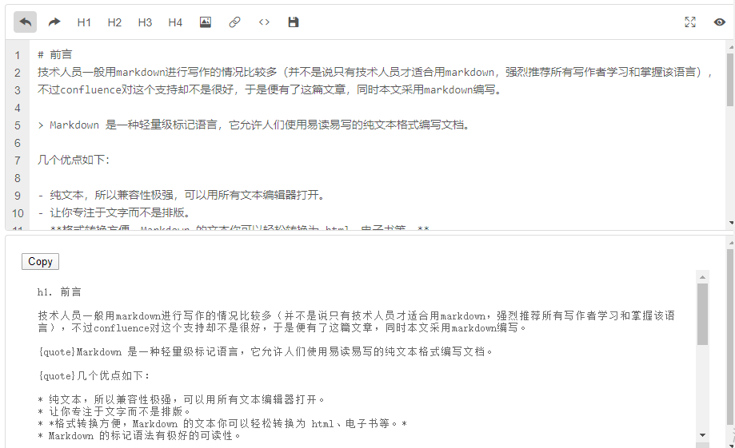
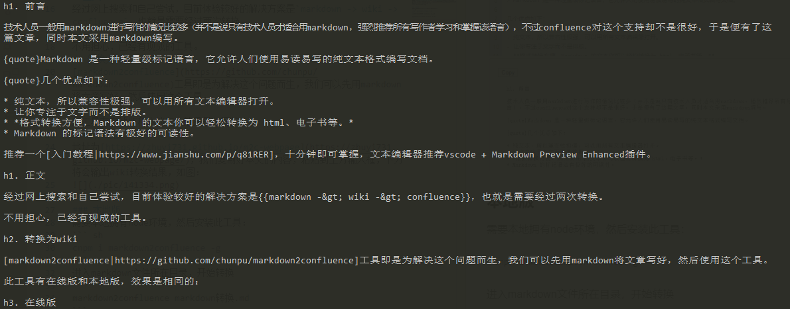
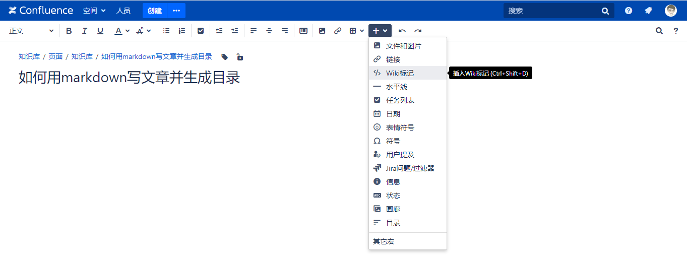
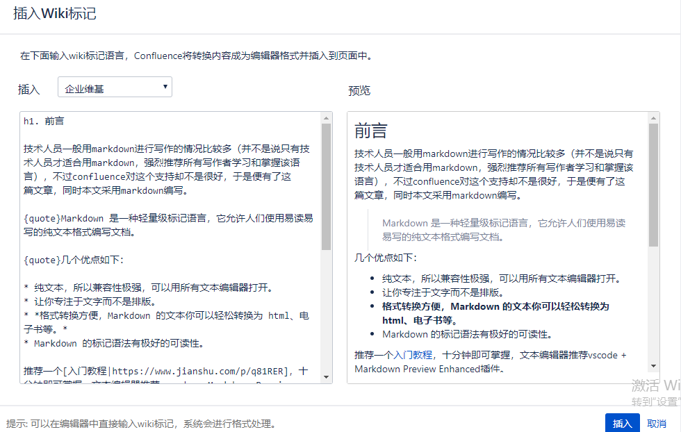
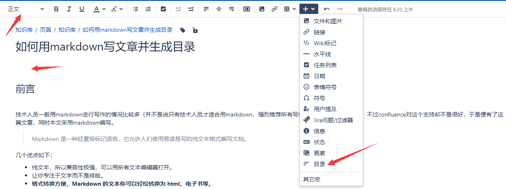

# 前言
技术人员一般用markdown进行写作的情况比较多（并不是说只有技术人员才适合用markdown，强烈推荐所有写作者学习和掌握该语言），不过confluence对这个支持却不是很好，于是便有了这篇文章，同时本文采用markdown编写。

> Markdown 是一种轻量级标记语言，它允许人们使用易读易写的纯文本格式编写文档。

几个优点如下：

- 纯文本，所以兼容性极强，可以用所有文本编辑器打开。
- 让你专注于文字而不是排版。
- **格式转换方便，Markdown 的文本你可以轻松转换为 html、电子书等。** 
- Markdown 的标记语法有极好的可读性。

推荐一个[入门教程](https://www.jianshu.com/p/q81RER)，十分钟即可掌握，文本编辑器推荐vscode + Markdown Preview Enhanced插件。

# 正文
经过网上搜索和自己尝试，目前体验较好的解决方案是`markdown -> wiki -> confluence`，也就是需要经过两次转换。

不用担心，已经有现成的工具。
## 转换为wiki
[markdown2confluence](https://github.com/chunpu/markdown2confluence)工具即是为解决这个问题而生，我们可以先用markdown将文章写好，然后使用这个工具。

此工具有在线版和本地版，效果是相同的：
### 在线版
地址为[https://zhuyi731.github.io/m2c-webpage](https://zhuyi731.github.io/m2c-webpage/)，我们复制好本文的内容，粘贴到上方输入框，下方将会输出wiki转换结果，如图：


### 本地版
需要本地拥有node环境，然后安装此工具：
``` sh
cnpm i markdown2confluence -g
```
进入markdown文件所在目录，开始转换
```
markdown2confluence markdown转换.md
```
转换结果会以标准输出的方式打印到控制台：

## 导入wiki
经过上述操作后，下一步就是在confluence导入wiki文本了。

首先创建一篇文章，进入编辑页面，编辑器导航栏最右边有一个`＋`按钮，点击插入`Wiki标记`，如图：


接下来选择插入*企业维基*（默认），然后粘贴wiki文本到左侧，右侧即可查看效果：


点击插入按钮将内容添加到正文，效果还是很不错的哈。

- 注： 由于markdown图片类似于html外部引入，图片则需要在confluence文中对应的位置手动上传一下。
## 生成目录
熟悉markdown语法的作者都知道，编写文章的时候会指定标题的层次，同时也就形成了目录，无需额外操作。

在这里我们需要稍稍操作一下，"手动"导入一下目录。

光标移动到第一个标题前，插入一行空白，然后在编辑器导航栏将这行设置为正文内容（可能默认为标题，这样生成目录的时候就会多一个名字空白的栏目），接下来点击编辑器导航栏右侧`＋`按钮，选择插入目录宏，如图：


预览界面可以看到目录，左侧可以对样式进行一些调整，这里就不贴图了，点击插入按钮，目录即可添加到正文。
